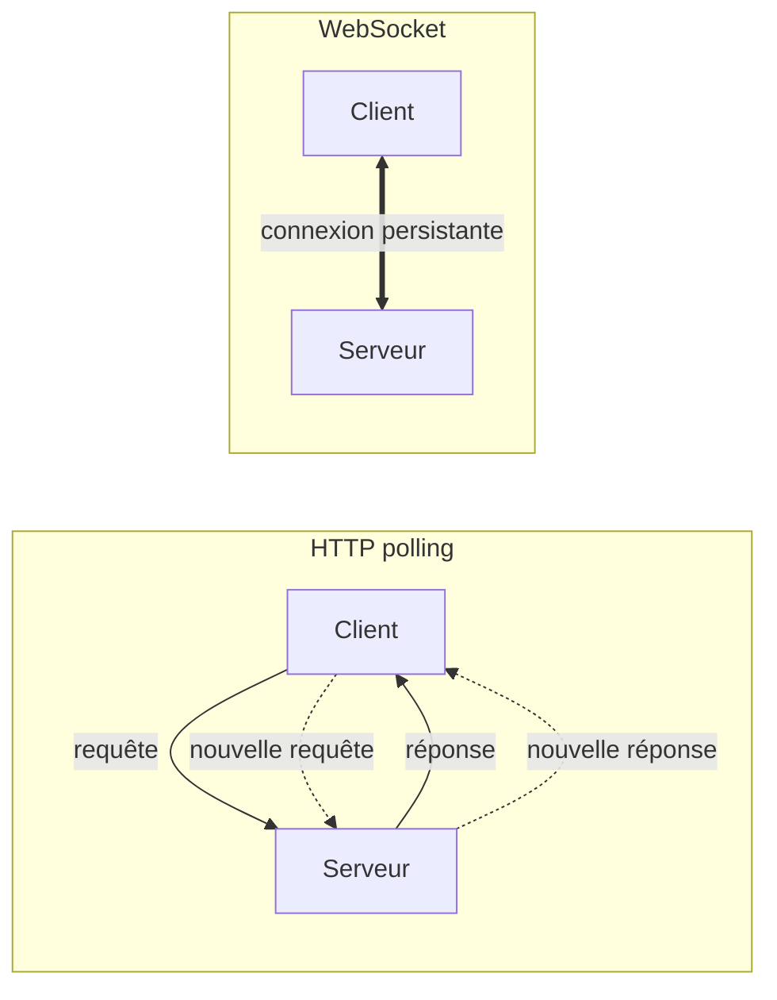
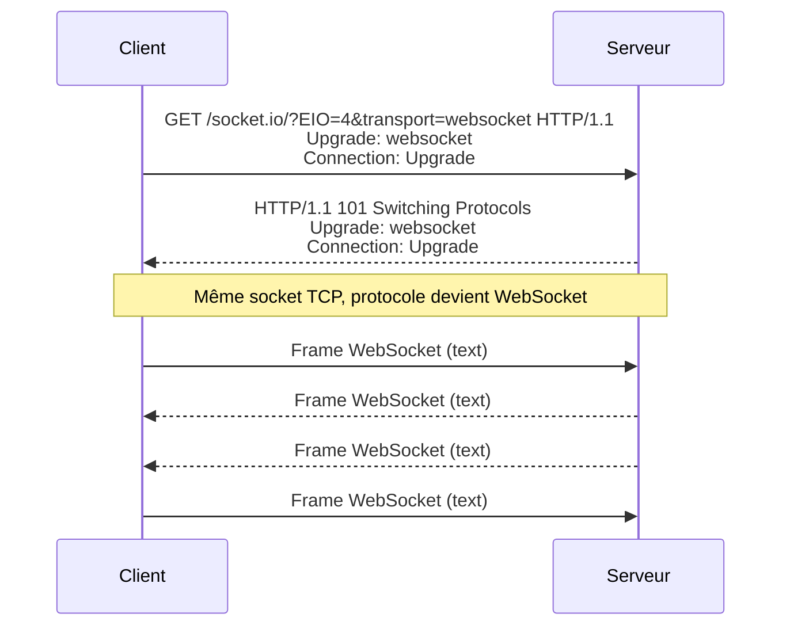

# Handbook WebSockets & Architecture AWS

> _Hidden in Plain Sight_ — Phase 2 multijoueur
>
> Comprendre les WebSockets implémentés avec NestJS, et suivre le voyage complet d'un clic depuis le navigateur jusqu'au serveur et retour, à travers toute l'infrastructure AWS.

## Table des matières

### Partie 1 — Les WebSockets dans NestJS

1. [Pourquoi des WebSockets ?](#1-pourquoi-des-websockets)
2. [Anatomie d'une connexion WebSocket](#2-anatomie-dune-connexion-websocket)
3. [Pour aller plus loin : le protocole en profondeur](#3-pour-aller-plus-loin-le-protocole-en-profondeur)
4. [NestJS Gateway : la théorie](#4-nestjs-gateway-la-théorie)
5. [Notre Gateway : `game.gateway.ts` ligne par ligne](#5-notre-gateway-gamegatewayts-ligne-par-ligne)
6. [Les services métier : RoomRegistry et GameRoom](#6-les-services-métier-roomregistry-et-gameroom)
7. [Les 9 flux du jeu en diagrammes de séquence](#7-les-9-flux-du-jeu-en-diagrammes-de-séquence)

### Partie 2 — Du clic à l'écran : voyage end-to-end

8. [Vue d'avion : l'architecture complète](#8-vue-davion-larchitecture-complète)
9. [Phase 1 : charger le jeu](#9-phase-1-charger-le-jeu)
10. [Phase 2 : connecter le WebSocket](#10-phase-2-connecter-le-websocket)
11. [Phase 3 : jouer une partie](#11-phase-3-jouer-une-partie)
12. [Le déploiement, vu rapidement](#12-le-déploiement-vu-rapidement)
13. [Annexes](#13-annexes)

---

# Partie 1 — Les WebSockets dans NestJS

## 1. Pourquoi des WebSockets ?

Avant de comprendre comment les WebSockets fonctionnent, il faut comprendre pourquoi ils existent — et pour ça, regardons d'abord le modèle qu'on utilise tous les jours sans y penser : HTTP.

### Le modèle HTTP classique

Quand tu charges une page web, ton navigateur ouvre une connexion vers le serveur, envoie une requête (`GET /index.html`), reçoit une réponse, et **ferme** la connexion. Si tu veux savoir si quelque chose a changé côté serveur, tu dois rouvrir une connexion, redemander, et refermer. C'est un modèle **request/response** strictement unidirectionnel : le client parle, le serveur répond, puis silence radio.

Analogie : imagine que tu envoies un SMS à un ami pour savoir s'il est arrivé. Tu envoies "Tu es arrivé ?", il répond "Pas encore". Tu attends. Tu renvoies "Et là ?", il répond "Toujours pas". Et tu recommences toutes les deux secondes. C'est épuisant pour tout le monde, ça consomme du forfait, et tu n'apprends jamais l'information _au moment précis_ où elle devient vraie — tu l'apprends à ta prochaine question.

C'est exactement la situation d'un client HTTP qui veut suivre un état qui change côté serveur.

### Le polling et ses limites

La parade naïve s'appelle le **polling** : le client envoie une nouvelle requête à intervalle régulier pour demander "alors, du nouveau ?". Pour un jeu multijoueur où l'état change à 30 ou 60 fois par seconde, ça veut dire 30-60 requêtes HTTP par seconde, **par joueur**, juste pour rafraîchir l'écran.

Chaque requête HTTP, c'est :

- un handshake TCP (3 paquets aller-retour),
- éventuellement un handshake TLS (encore plusieurs aller-retours),
- des en-têtes HTTP qui pèsent souvent plus que la donnée elle-même (plusieurs centaines d'octets pour `User-Agent`, `Cookie`, `Accept`, etc.),
- côté serveur, du travail d'authentification, de routage, de sérialisation à chaque appel.

Pour quatre joueurs à 60 ticks par seconde, on est à 240 requêtes par seconde sur l'API, dont 99% renvoient probablement "rien de nouveau". C'est insoutenable en latence (chaque rafraîchissement attend un aller-retour réseau), en bande passante (gigantesque overhead d'en-têtes) et en CPU serveur.

### Long-polling, SSE, WebSocket

Plusieurs techniques ont été inventées pour contourner le problème :

- **Long-polling** : le client envoie une requête, le serveur la garde ouverte jusqu'à ce qu'il ait quelque chose à dire, puis répond et le client en ouvre une nouvelle. Limite les requêtes inutiles, mais reste fondamentalement unidirectionnel et coûte un handshake par cycle.
- **Server-Sent Events (SSE)** : connexion HTTP qui reste ouverte et où le serveur peut pousser des messages au client à tout moment. Léger et simple, mais à sens unique (serveur → client uniquement).
- **WebSocket** : connexion TCP qui reste ouverte et où **les deux côtés** peuvent envoyer des messages à n'importe quel moment, sans nouvelles requêtes HTTP à chaque fois. C'est la seule des trois qui soit vraiment bidirectionnelle et symétrique.

Pour un jeu, on a besoin des deux sens : le client envoie des inputs (tir, déplacement) ; le serveur pousse le state à chaque tick. WebSocket gagne.

### Le WebSocket en une phrase

> Un WebSocket est une connexion TCP qui reste ouverte indéfiniment, dans laquelle client et serveur peuvent s'envoyer des messages à tout moment, sans le coût d'une nouvelle requête HTTP à chaque échange.

C'est tout. Le reste — handshake initial, formats de frames, masking — n'est que de la plomberie pour faire tenir cette promesse au-dessus de l'infrastructure HTTP existante.

### Pourquoi c'est crucial pour notre jeu

_Hidden in Plain Sight_ est un jeu où :

- chaque joueur envoie en continu sa position de souris (pour que les autres voient son viseur),
- le serveur tick à **30 Hz** (cf. `SERVER_TICK_HZ` dans `@hips/shared`) et broadcast l'état complet de la partie à tous les joueurs de la room,
- un clic souris doit se traduire en tir, en détection de collision, et en notification de mort _en temps réel_, idéalement en moins de 100 ms aller-retour.

Sans WebSocket, c'est injouable : le polling à 30 Hz consommerait toute la bande passante d'un EC2 t3.micro pour quatre joueurs, et la latence ajoutée par les handshakes HTTP rendrait le jeu visqueux. Avec WebSocket, on a une connexion par joueur, ouverte pendant toute la partie, et chaque frame de gameplay (input ou state) pèse quelques dizaines d'octets.

### Visualiser la différence



À gauche, chaque échange est une nouvelle conversation — il faut se présenter à chaque fois. À droite, une seule connexion sert tous les échanges de la session : on parle quand on a quelque chose à dire, on écoute le reste du temps. C'est plus efficace, plus rapide, et bien plus simple à raisonner côté code.

## 2. Anatomie d'une connexion WebSocket

Maintenant qu'on sait pourquoi WebSocket existe, regardons comment une connexion est effectivement établie — et pourquoi le projet utilise une couche au-dessus appelée Socket.IO.

### Le handshake : HTTP qui devient WebSocket

Un détail élégant du protocole WebSocket, c'est qu'il **ne commence pas comme du WebSocket**. Il commence comme une requête HTTP tout à fait classique, avec deux en-têtes spéciaux qui demandent poliment au serveur "et si on changeait de protocole ?".

Voici à quoi ressemble la requête envoyée par le navigateur quand le client Socket.IO s'initialise :

```http
GET /socket.io/?EIO=4&transport=websocket HTTP/1.1
Host: api.marche-ou-creve.com
Upgrade: websocket
Connection: Upgrade
Sec-WebSocket-Key: dGhlIHNhbXBsZSBub25jZQ==
Sec-WebSocket-Version: 13
Origin: https://game.marche-ou-creve.com
```

Tout est en HTTP standard. Mais les deux dernières lignes du quartet `Upgrade` / `Connection` disent : "Je voudrais utiliser cette connexion TCP pour autre chose que HTTP — du WebSocket, plus précisément." Le serveur, s'il est d'accord, répond :

```http
HTTP/1.1 101 Switching Protocols
Upgrade: websocket
Connection: Upgrade
Sec-WebSocket-Accept: s3pPLMBiTxaQ9kYGzzhZRbK+xOo=
```

Le code `101 Switching Protocols` est rare en HTTP ordinaire — il signifie "OK, à partir de maintenant on ne parle plus HTTP, on parle WebSocket". La connexion TCP sous-jacente reste la même, mais le contenu qui y transite change de protocole.

### Pourquoi 80/443 et pas un port à part

Les WebSockets passent par les ports HTTP standard (80 en clair, 443 en TLS). Ce n'est pas un hasard : c'était une condition de viabilité du protocole. Sur un réseau d'entreprise typique, un firewall bloque 99% des ports sortants — mais laisse passer 80 et 443. En réutilisant ces ports et en commençant la conversation par une requête HTTP, WebSocket traverse tous ces firewalls et tous ces proxys d'entreprise sans qu'on ait à demander à l'IT d'ouvrir quoi que ce soit.

C'est aussi ce qui permet à **Caddy** dans notre projet d'agir comme reverse proxy sans configuration spéciale. Dans le `Caddyfile`, on a :

```
api.marche-ou-creve.com {
    reverse_proxy localhost:3000
}
```

Trois lignes, c'est tout. Caddy voit du HTTP qui demande à upgrade, transmet la requête au backend NestJS (qui répond `101 Switching Protocols`), puis fait passer chaque frame WebSocket dans les deux sens. Du point de vue de Caddy, c'est une connexion HTTP très longue, et il sait gérer ça nativement.

### Le handshake en diagramme



Une seule connexion TCP, deux phases : d'abord du HTTP qui négocie l'upgrade, puis du WebSocket qui dure aussi longtemps que la session.

### Socket.IO : une couche par-dessus

WebSocket brut, c'est un canal de bytes. Tu peux y mettre du texte ou du binaire, et c'est tout. Aucune notion de "channel", "event", "room", "broadcast", "reconnexion" — il faut tout réinventer à la main. C'est là qu'arrive **Socket.IO**, la bibliothèque qu'on utilise dans le projet (côté client `socket.io-client`, côté serveur via le module `@nestjs/websockets` qui embarque le serveur `socket.io`).

Socket.IO ajoute, par-dessus la connexion WebSocket, plusieurs choses indispensables :

- **Events nommés** : au lieu de pousser un blob de bytes, tu envoies `socket.emit('fire', { pointer })` et l'autre côté écoute `socket.on('fire', handler)`. Le payload est sérialisé en JSON automatiquement.
- **Rooms** : groupes logiques de sockets, indispensables pour notre jeu. Quand on broadcast l'état d'une partie, on veut le diffuser uniquement aux joueurs de cette partie, pas à tous les sockets connectés. `this.server.to(roomCode).emit('state', ...)` fait exactement ça.
- **Reconnexion automatique** avec backoff exponentiel. Si le WebSocket se ferme à cause d'une coupure réseau, le client retente tout seul — sans que ton code applicatif ait à s'en soucier.
- **Fallback long-polling** : si le WebSocket est bloqué par un proxy hostile, Socket.IO bascule automatiquement sur du long-polling. On ne s'en sert pas en pratique dans le projet, mais c'est un filet de sécurité.
- **Acknowledgments** : `socket.emit('event', payload, (response) => ...)` permet d'attendre une réponse comme un appel de fonction. On ne l'utilise pas non plus pour l'instant — tous nos handlers fonctionnent par broadcast.
- **Namespaces** : sous-canaux logiques sur la même connexion (ex. `/admin` et `/game`). Le projet n'en utilise qu'un seul (le namespace par défaut `/`).

### Le coût de Socket.IO

Cette couche n'est pas gratuite. Socket.IO ajoute son propre **protocole par-dessus le protocole WebSocket** : chaque message est préfixé par des codes (`42` pour un event, `2` pour un ping, `3` pour un pong, etc.). Un message comme `socket.emit('fire', { pointer: { x: 10, y: 20 }})` est concrètement transmis sous la forme :

```
42["fire",{"pointer":{"x":10,"y":20}}]
```

Conséquence pratique : **un client WebSocket brut ne peut pas parler à un serveur Socket.IO**, et vice-versa. Le client et le serveur doivent tous les deux utiliser Socket.IO, dans des versions compatibles (notre client utilise `socket.io-client@4.x`, le serveur `socket.io@4.x` — Engine.IO protocol version 4, d'où le `EIO=4` dans l'URL du handshake).

### Termes clés en survol

On entend souvent ces mots autour des WebSockets — voici un survol rapide ; les détails sont au chapitre 3 pour les curieux.

- **Frame** : l'unité de transmission. Un message peut tenir en une frame ou être fragmenté en plusieurs.
- **Ping/pong** : mécanisme intégré au protocole pour vérifier qu'une connexion est encore vivante. Socket.IO l'utilise toutes les ~25 secondes.
- **Masking** : un XOR appliqué côté client sur le payload pour des raisons historiques de sécurité des proxys. Détaillé au chapitre 3.

Si tu n'es pas curieux de la plomberie, tu peux **sauter le chapitre 3** et aller directement au chapitre 4. Tout ce qui suit dans le handbook se comprend avec les bases qu'on vient de poser.

## 3. Pour aller plus loin : le protocole en profondeur

> Ce chapitre est **optionnel**. Il décrit ce qui se passe à l'octet près sur le fil. Si tu n'es pas curieux de cette plomberie, passe au chapitre 4.

### Anatomie d'une frame WebSocket

Une frame WebSocket commence par un en-tête de 2 à 14 octets, suivi du payload. La structure est définie par la **RFC 6455** :

```
 0                   1                   2                   3
 0 1 2 3 4 5 6 7 8 9 0 1 2 3 4 5 6 7 8 9 0 1 2 3 4 5 6 7 8 9 0 1
+-+-+-+-+-------+-+-------------+-------------------------------+
|F|R|R|R| opcode|M| Payload len |    Extended payload length    |
|I|S|S|S|  (4)  |A|     (7)     |             (16/64)           |
|N|V|V|V|       |S|             |                               |
| |1|2|3|       |K|             |                               |
+-+-+-+-+-------+-+-------------+-------------------------------+
|     Extended payload length continued, if payload len == 127  |
+-------------------------------+-------------------------------+
|                              ...                              |
+-------------------------------+ Masking-key (if MASK set, 4B) |
|                              ...                              |
+---------------------------------------------------------------+
|                       Payload data                            |
+---------------------------------------------------------------+
```

Décodage rapide des champs :

- **FIN** (1 bit) : à 1 si cette frame est la dernière du message, à 0 si le message est fragmenté sur plusieurs frames.
- **RSV1-3** (3 bits) : réservés pour des extensions (compression `permessage-deflate` typiquement). À 0 sinon.
- **opcode** (4 bits) : type de frame. Les principaux :
  - `0x0` continuation (fragment qui suit une frame précédente)
  - `0x1` text (UTF-8)
  - `0x2` binary
  - `0x8` close
  - `0x9` ping
  - `0xA` pong
- **MASK** (1 bit) : à 1 si le payload est masqué (toujours le cas côté client, jamais côté serveur).
- **Payload length** (7 bits, étendu à 16 ou 64 bits si nécessaire) : taille du payload en octets.
- **Masking-key** (4 octets, si `MASK` est à 1) : clé XOR aléatoire.
- **Payload data** : la donnée elle-même.

Pour un event Socket.IO typique du jeu (`42["state", { ...payload... }]`), une frame ressemble à :

```
0x81 0x82 [mask de 4 octets] [payload XORé avec le mask]
     ^----------- payload de 130 octets (0x82 sans le bit MASK)
^---------------- FIN=1, opcode=text (0x1)
```

L'en-tête fait 6 octets ici. C'est négligeable comparé aux centaines d'octets d'en-têtes HTTP qu'on enverrait en polling.

### Le masking côté client : pourquoi ?

La règle est asymétrique : **le client masque toujours**, **le serveur ne masque jamais**. C'est contre-intuitif au premier abord — où est le gain de sécurité si seul un côté chiffre, avec une clé envoyée en clair dans la même frame ?

La réponse est historique. Le masking n'a rien à voir avec la confidentialité (le TLS s'en charge). Il existe pour empêcher une attaque appelée **cache poisoning** sur certains proxys HTTP des années 2000 : un client malveillant aurait pu envoyer des octets soigneusement choisis dans un payload WebSocket, que des proxys intermédiaires bogués auraient interprété comme du HTTP, et auraient cachés. Le masking — un simple XOR avec une clé aléatoire — rend impossible cette construction prédictive depuis le client. Comme les serveurs ne sont pas censés émettre de payload contrôlable par l'attaquant, le serveur n'a pas besoin de masquer.

C'est un détail qu'on ne voit jamais en haut niveau — la lib Socket.IO le gère pour nous — mais ça explique pourquoi le code source de `socket.io-client` contient une boucle XOR sur chaque frame sortante.

### Ping/pong et keepalive

Une connexion TCP peut "mourir silencieusement" : le routeur du milieu reboote, le wifi décroche, le NAT expire son entrée — et ni le client ni le serveur n'ont reçu de `FIN` ou `RST`. Du point de vue logique, ils croient toujours être connectés.

Pour détecter ça, WebSocket définit deux opcodes spéciaux :

- `0x9` ping : "tu m'entends ?"
- `0xA` pong : "oui, je t'entends"

Le serveur (ou le client) envoie un ping ; l'autre côté doit répondre par un pong avec le même payload. Si aucun pong ne revient dans un certain délai, la connexion est considérée morte et fermée.

Socket.IO encapsule ce mécanisme : par défaut, le serveur envoie un ping toutes les **25 secondes**, et attend le pong dans les **20 secondes** suivantes. C'est paramétrable côté serveur via `pingInterval` et `pingTimeout`. Pour notre jeu sur EC2 t3.micro derrière Caddy, les valeurs par défaut sont parfaites.

### Fragmentation

Un message peut être splitté en plusieurs frames : la première a `FIN=0` et l'opcode du message, les suivantes ont `FIN=0` et l'opcode `0x0` (continuation), et la dernière a `FIN=1` et l'opcode `0x0`. C'est utile pour streamer un message dont on ne connaît pas la taille à l'avance.

En pratique, dans Socket.IO et dans notre jeu, on n'utilise jamais la fragmentation : tous nos payloads tiennent confortablement dans une seule frame.

### Limites pratiques sur Node.js et un EC2 t3.micro

Côté serveur, chaque connexion WebSocket coûte de la RAM (~50-100 KB pour le socket Node.js, les buffers internes, l'état Socket.IO) et un file descriptor.

Sur un EC2 t3.micro (1 vCPU, 1 GB RAM), les limites pertinentes sont :

- **`ulimit -n`** (file descriptors par process) : par défaut 1024 sur Ubuntu. À augmenter si on vise plus de quelques centaines de connexions simultanées.
- **RAM disponible** : environ 700-800 MB pour Node après l'OS et Docker. À 100 KB par connexion, ça plafonne théoriquement vers 5-8000 connexions, mais bien avant ça le CPU saturerait.
- **Bande passante** : le t3.micro est limité à environ 5 Gbps en burst. Largement suffisant pour notre cas.

Pour notre jeu (4 joueurs par room, quelques rooms simultanées en pic), on est à deux ordres de grandeur sous les limites. Aucun souci.

### Pour aller plus loin

- **RFC 6455** ([rfc-editor.org/rfc/rfc6455](https://www.rfc-editor.org/rfc/rfc6455)) : la spec officielle du protocole. ~70 pages, étonnamment lisibles.
- **Engine.IO protocol** ([github.com/socketio/engine.io-protocol](https://github.com/socketio/engine.io-protocol)) : la couche transport sous Socket.IO, qui gère le fallback long-polling.
- **Socket.IO protocol** ([github.com/socketio/socket.io-protocol](https://github.com/socketio/socket.io-protocol)) : la couche events / rooms / acks qui s'empile par-dessus Engine.IO.

## 4. NestJS Gateway : la théorie

_À rédiger._

## 5. Notre Gateway : `game.gateway.ts` ligne par ligne

_À rédiger._

## 6. Les services métier : RoomRegistry et GameRoom

_À rédiger._

## 7. Les 9 flux du jeu en diagrammes de séquence

### 7.1 Connexion d'un client

_À rédiger._

### 7.2 Création / rejoindre une room

_À rédiger._

### 7.3 Lancement de partie

_À rédiger._

### 7.4 Input joueur (clic souris → tir)

_À rédiger._

### 7.5 Boucle de tick serveur

_À rédiger._

### 7.6 Détection de collision

_À rédiger._

### 7.7 Fin de partie

_À rédiger._

### 7.8 Déconnexion brutale

_À rédiger._

### 7.9 Cycle de vie complet d'une partie

_À rédiger._

---

# Partie 2 — Du clic à l'écran : voyage end-to-end

## 8. Vue d'avion : l'architecture complète

_À rédiger._

## 9. Phase 1 : charger le jeu

_À rédiger._

## 10. Phase 2 : connecter le WebSocket

_À rédiger._

## 11. Phase 3 : jouer une partie

_À rédiger._

## 12. Le déploiement, vu rapidement

_À rédiger._

## 13. Annexes

### Glossaire

_À rédiger._

### Liens utiles

_À rédiger._
