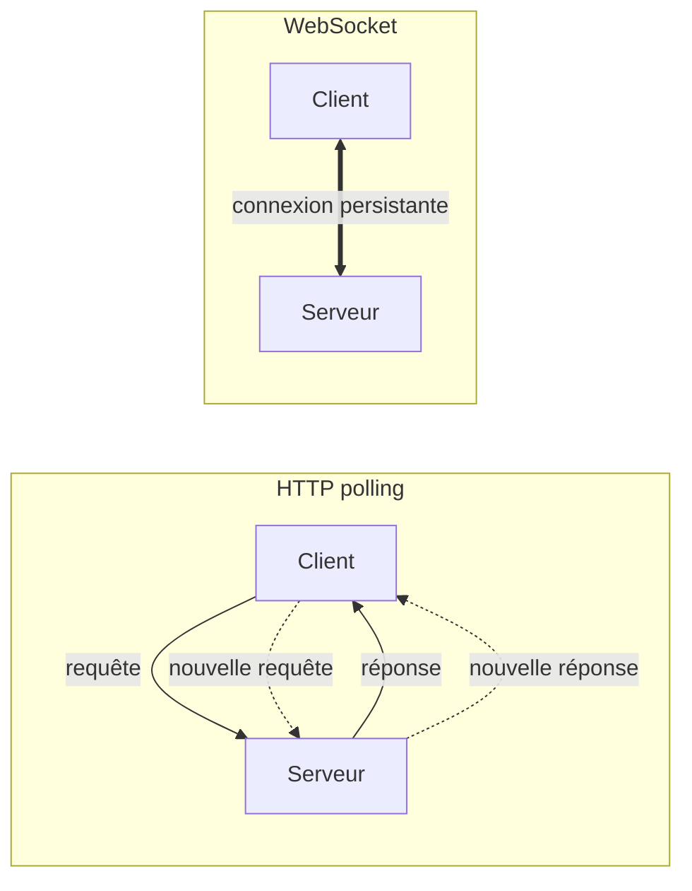

# Handbook WebSockets & Architecture AWS

> _Hidden in Plain Sight_ — Phase 2 multijoueur
>
> Comprendre les WebSockets implémentés avec NestJS, et suivre le voyage complet d'un clic depuis le navigateur jusqu'au serveur et retour, à travers toute l'infrastructure AWS.

## Table des matières

### Partie 1 — Les WebSockets dans NestJS

1. [Pourquoi des WebSockets ?](#1-pourquoi-des-websockets)
2. [Anatomie d'une connexion WebSocket](#2-anatomie-dune-connexion-websocket)
3. [Pour aller plus loin : le protocole en profondeur](#3-pour-aller-plus-loin-le-protocole-en-profondeur)
4. [NestJS Gateway : la théorie](#4-nestjs-gateway-la-théorie)
5. [Notre Gateway : `game.gateway.ts` ligne par ligne](#5-notre-gateway-gamegatewayts-ligne-par-ligne)
6. [Les services métier : RoomRegistry et GameRoom](#6-les-services-métier-roomregistry-et-gameroom)
7. [Les 9 flux du jeu en diagrammes de séquence](#7-les-9-flux-du-jeu-en-diagrammes-de-séquence)

### Partie 2 — Du clic à l'écran : voyage end-to-end

8. [Vue d'avion : l'architecture complète](#8-vue-davion-larchitecture-complète)
9. [Phase 1 : charger le jeu](#9-phase-1-charger-le-jeu)
10. [Phase 2 : connecter le WebSocket](#10-phase-2-connecter-le-websocket)
11. [Phase 3 : jouer une partie](#11-phase-3-jouer-une-partie)
12. [Le déploiement, vu rapidement](#12-le-déploiement-vu-rapidement)
13. [Annexes](#13-annexes)

---

# Partie 1 — Les WebSockets dans NestJS

## 1. Pourquoi des WebSockets ?

Avant de comprendre comment les WebSockets fonctionnent, il faut comprendre pourquoi ils existent — et pour ça, regardons d'abord le modèle qu'on utilise tous les jours sans y penser : HTTP.

### Le modèle HTTP classique

Quand tu charges une page web, ton navigateur ouvre une connexion vers le serveur, envoie une requête (`GET /index.html`), reçoit une réponse, et **ferme** la connexion. Si tu veux savoir si quelque chose a changé côté serveur, tu dois rouvrir une connexion, redemander, et refermer. C'est un modèle **request/response** strictement unidirectionnel : le client parle, le serveur répond, puis silence radio.

Analogie : imagine que tu envoies un SMS à un ami pour savoir s'il est arrivé. Tu envoies "Tu es arrivé ?", il répond "Pas encore". Tu attends. Tu renvoies "Et là ?", il répond "Toujours pas". Et tu recommences toutes les deux secondes. C'est épuisant pour tout le monde, ça consomme du forfait, et tu n'apprends jamais l'information _au moment précis_ où elle devient vraie — tu l'apprends à ta prochaine question.

C'est exactement la situation d'un client HTTP qui veut suivre un état qui change côté serveur.

### Le polling et ses limites

La parade naïve s'appelle le **polling** : le client envoie une nouvelle requête à intervalle régulier pour demander "alors, du nouveau ?". Pour un jeu multijoueur où l'état change à 30 ou 60 fois par seconde, ça veut dire 30-60 requêtes HTTP par seconde, **par joueur**, juste pour rafraîchir l'écran.

Chaque requête HTTP, c'est :

- un handshake TCP (3 paquets aller-retour),
- éventuellement un handshake TLS (encore plusieurs aller-retours),
- des en-têtes HTTP qui pèsent souvent plus que la donnée elle-même (plusieurs centaines d'octets pour `User-Agent`, `Cookie`, `Accept`, etc.),
- côté serveur, du travail d'authentification, de routage, de sérialisation à chaque appel.

Pour quatre joueurs à 60 ticks par seconde, on est à 240 requêtes par seconde sur l'API, dont 99% renvoient probablement "rien de nouveau". C'est insoutenable en latence (chaque rafraîchissement attend un aller-retour réseau), en bande passante (gigantesque overhead d'en-têtes) et en CPU serveur.

### Long-polling, SSE, WebSocket

Plusieurs techniques ont été inventées pour contourner le problème :

- **Long-polling** : le client envoie une requête, le serveur la garde ouverte jusqu'à ce qu'il ait quelque chose à dire, puis répond et le client en ouvre une nouvelle. Limite les requêtes inutiles, mais reste fondamentalement unidirectionnel et coûte un handshake par cycle.
- **Server-Sent Events (SSE)** : connexion HTTP qui reste ouverte et où le serveur peut pousser des messages au client à tout moment. Léger et simple, mais à sens unique (serveur → client uniquement).
- **WebSocket** : connexion TCP qui reste ouverte et où **les deux côtés** peuvent envoyer des messages à n'importe quel moment, sans nouvelles requêtes HTTP à chaque fois. C'est la seule des trois qui soit vraiment bidirectionnelle et symétrique.

Pour un jeu, on a besoin des deux sens : le client envoie des inputs (tir, déplacement) ; le serveur pousse le state à chaque tick. WebSocket gagne.

### Le WebSocket en une phrase

> Un WebSocket est une connexion TCP qui reste ouverte indéfiniment, dans laquelle client et serveur peuvent s'envoyer des messages à tout moment, sans le coût d'une nouvelle requête HTTP à chaque échange.

C'est tout. Le reste — handshake initial, formats de frames, masking — n'est que de la plomberie pour faire tenir cette promesse au-dessus de l'infrastructure HTTP existante.

### Pourquoi c'est crucial pour notre jeu

_Hidden in Plain Sight_ est un jeu où :

- chaque joueur envoie en continu sa position de souris (pour que les autres voient son viseur),
- le serveur tick à **30 Hz** (cf. `SERVER_TICK_HZ` dans `@hips/shared`) et broadcast l'état complet de la partie à tous les joueurs de la room,
- un clic souris doit se traduire en tir, en détection de collision, et en notification de mort _en temps réel_, idéalement en moins de 100 ms aller-retour.

Sans WebSocket, c'est injouable : le polling à 30 Hz consommerait toute la bande passante d'un EC2 t3.micro pour quatre joueurs, et la latence ajoutée par les handshakes HTTP rendrait le jeu visqueux. Avec WebSocket, on a une connexion par joueur, ouverte pendant toute la partie, et chaque frame de gameplay (input ou state) pèse quelques dizaines d'octets.

### Visualiser la différence

À gauche, chaque échange est une nouvelle conversation — il faut se présenter à chaque fois. À droite, une seule connexion sert tous les échanges de la session : on parle quand on a quelque chose à dire, on écoute le reste du temps. C'est plus efficace, plus rapide, et bien plus simple à raisonner côté code.

## 2. Anatomie d'une connexion WebSocket

_À rédiger._

## 3. Pour aller plus loin : le protocole en profondeur

_À rédiger._

## 4. NestJS Gateway : la théorie

_À rédiger._

## 5. Notre Gateway : `game.gateway.ts` ligne par ligne

_À rédiger._

## 6. Les services métier : RoomRegistry et GameRoom

_À rédiger._

## 7. Les 9 flux du jeu en diagrammes de séquence

### 7.1 Connexion d'un client

_À rédiger._

### 7.2 Création / rejoindre une room

_À rédiger._

### 7.3 Lancement de partie

_À rédiger._

### 7.4 Input joueur (clic souris → tir)

_À rédiger._

### 7.5 Boucle de tick serveur

_À rédiger._

### 7.6 Détection de collision

_À rédiger._

### 7.7 Fin de partie

_À rédiger._

### 7.8 Déconnexion brutale

_À rédiger._

### 7.9 Cycle de vie complet d'une partie

_À rédiger._

---

# Partie 2 — Du clic à l'écran : voyage end-to-end

## 8. Vue d'avion : l'architecture complète

_À rédiger._

## 9. Phase 1 : charger le jeu

_À rédiger._

## 10. Phase 2 : connecter le WebSocket

_À rédiger._

## 11. Phase 3 : jouer une partie

_À rédiger._

## 12. Le déploiement, vu rapidement

_À rédiger._

## 13. Annexes

### Glossaire

_À rédiger._

### Liens utiles

_À rédiger._
