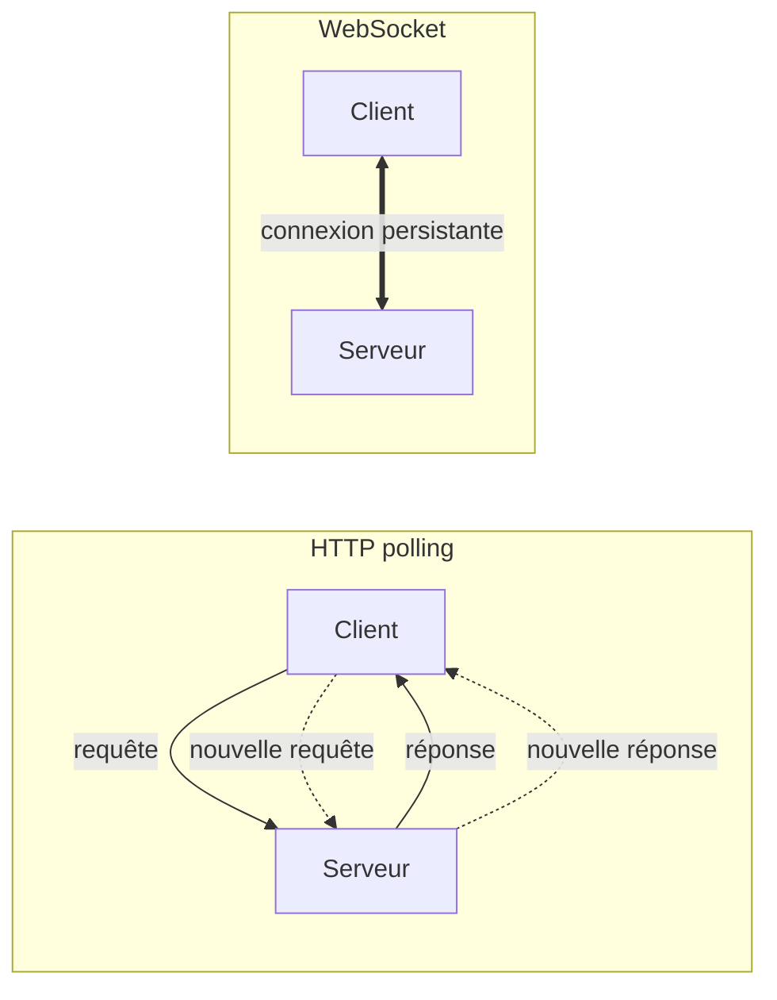
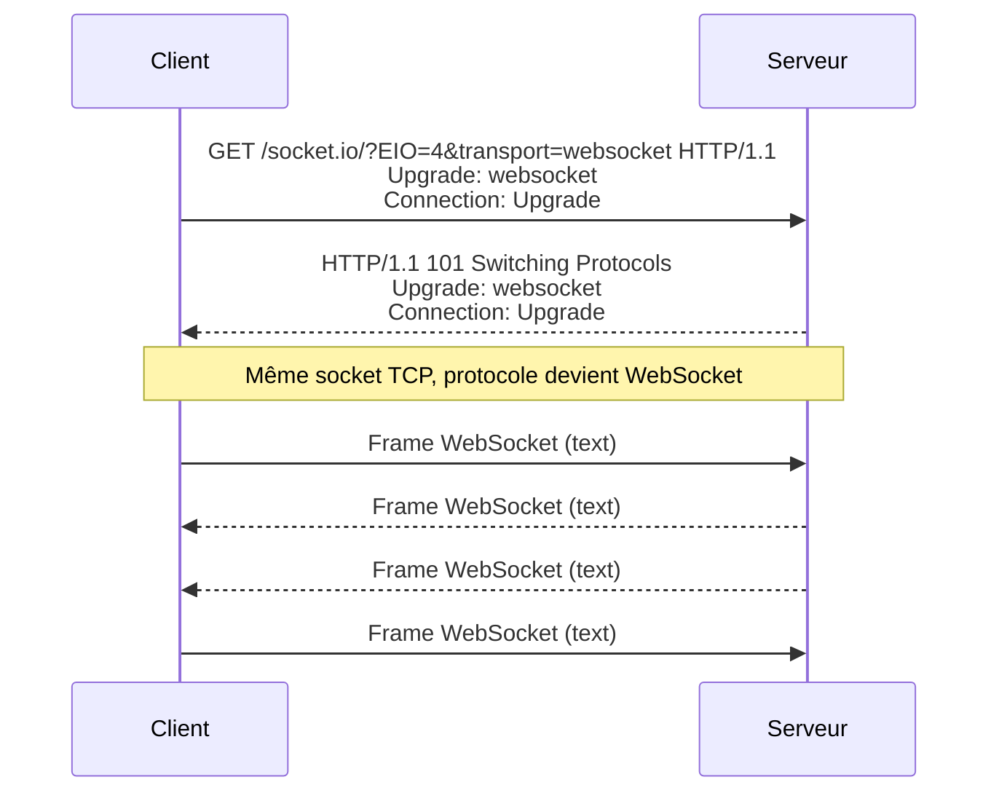
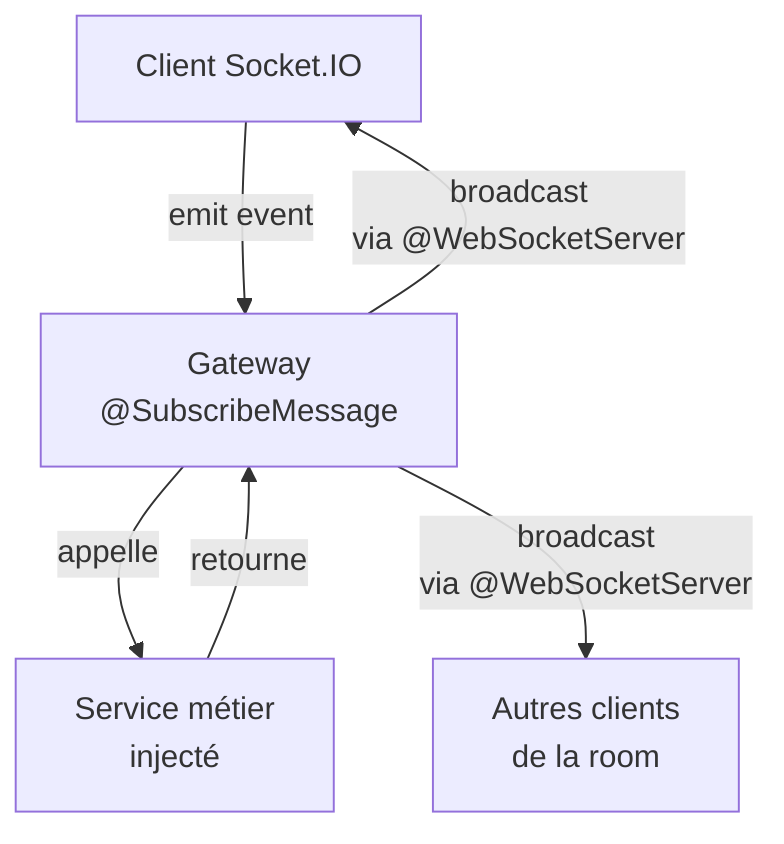
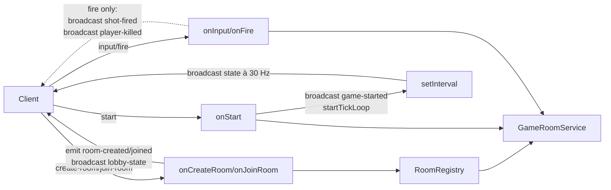
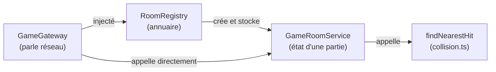

# Handbook WebSockets & Architecture AWS

> _Hidden in Plain Sight_ — Phase 2 multijoueur
>
> Comprendre les WebSockets implémentés avec NestJS, et suivre le voyage complet d'un clic depuis le navigateur jusqu'au serveur et retour, à travers toute l'infrastructure AWS.

## Table des matières

### Partie 1 — Les WebSockets dans NestJS

1. [Pourquoi des WebSockets ?](#1-pourquoi-des-websockets)
2. [Anatomie d'une connexion WebSocket](#2-anatomie-dune-connexion-websocket)
3. [Pour aller plus loin : le protocole en profondeur](#3-pour-aller-plus-loin-le-protocole-en-profondeur)
4. [NestJS Gateway : la théorie](#4-nestjs-gateway-la-théorie)
5. [Notre Gateway : `game.gateway.ts` ligne par ligne](#5-notre-gateway-gamegatewayts-ligne-par-ligne)
6. [Les services métier : RoomRegistry et GameRoom](#6-les-services-métier-roomregistry-et-gameroom)
7. [Les 9 flux du jeu en diagrammes de séquence](#7-les-9-flux-du-jeu-en-diagrammes-de-séquence)

### Partie 2 — Du clic à l'écran : voyage end-to-end

8. [Vue d'avion : l'architecture complète](#8-vue-davion-larchitecture-complète)
9. [Phase 1 : charger le jeu](#9-phase-1-charger-le-jeu)
10. [Phase 2 : connecter le WebSocket](#10-phase-2-connecter-le-websocket)
11. [Phase 3 : jouer une partie](#11-phase-3-jouer-une-partie)
12. [Le déploiement, vu rapidement](#12-le-déploiement-vu-rapidement)
13. [Annexes](#13-annexes)

---

# Partie 1 — Les WebSockets dans NestJS

## 1. Pourquoi des WebSockets ?

Avant de comprendre comment les WebSockets fonctionnent, il faut comprendre pourquoi ils existent — et pour ça, regardons d'abord le modèle qu'on utilise tous les jours sans y penser : HTTP.

### Le modèle HTTP classique

Quand tu charges une page web, ton navigateur ouvre une connexion vers le serveur, envoie une requête (`GET /index.html`), reçoit une réponse, et **ferme** la connexion. Si tu veux savoir si quelque chose a changé côté serveur, tu dois rouvrir une connexion, redemander, et refermer. C'est un modèle **request/response** strictement unidirectionnel : le client parle, le serveur répond, puis silence radio.

Analogie : imagine que tu envoies un SMS à un ami pour savoir s'il est arrivé. Tu envoies "Tu es arrivé ?", il répond "Pas encore". Tu attends. Tu renvoies "Et là ?", il répond "Toujours pas". Et tu recommences toutes les deux secondes. C'est épuisant pour tout le monde, ça consomme du forfait, et tu n'apprends jamais l'information _au moment précis_ où elle devient vraie — tu l'apprends à ta prochaine question.

C'est exactement la situation d'un client HTTP qui veut suivre un état qui change côté serveur.

### Le polling et ses limites

La parade naïve s'appelle le **polling** : le client envoie une nouvelle requête à intervalle régulier pour demander "alors, du nouveau ?". Pour un jeu multijoueur où l'état change à 30 ou 60 fois par seconde, ça veut dire 30-60 requêtes HTTP par seconde, **par joueur**, juste pour rafraîchir l'écran.

Chaque requête HTTP, c'est :

- un handshake TCP (3 paquets aller-retour),
- éventuellement un handshake TLS (encore plusieurs aller-retours),
- des en-têtes HTTP qui pèsent souvent plus que la donnée elle-même (plusieurs centaines d'octets pour `User-Agent`, `Cookie`, `Accept`, etc.),
- côté serveur, du travail d'authentification, de routage, de sérialisation à chaque appel.

Pour quatre joueurs à 60 ticks par seconde, on est à 240 requêtes par seconde sur l'API, dont 99% renvoient probablement "rien de nouveau". C'est insoutenable en latence (chaque rafraîchissement attend un aller-retour réseau), en bande passante (gigantesque overhead d'en-têtes) et en CPU serveur.

### Long-polling, SSE, WebSocket

Plusieurs techniques ont été inventées pour contourner le problème :

- **Long-polling** : le client envoie une requête, le serveur la garde ouverte jusqu'à ce qu'il ait quelque chose à dire, puis répond et le client en ouvre une nouvelle. Limite les requêtes inutiles, mais reste fondamentalement unidirectionnel et coûte un handshake par cycle.
- **Server-Sent Events (SSE)** : connexion HTTP qui reste ouverte et où le serveur peut pousser des messages au client à tout moment. Léger et simple, mais à sens unique (serveur → client uniquement).
- **WebSocket** : connexion TCP qui reste ouverte et où **les deux côtés** peuvent envoyer des messages à n'importe quel moment, sans nouvelles requêtes HTTP à chaque fois. C'est la seule des trois qui soit vraiment bidirectionnelle et symétrique.

Pour un jeu, on a besoin des deux sens : le client envoie des inputs (tir, déplacement) ; le serveur pousse le state à chaque tick. WebSocket gagne.

### Le WebSocket en une phrase

> Un WebSocket est une connexion TCP qui reste ouverte indéfiniment, dans laquelle client et serveur peuvent s'envoyer des messages à tout moment, sans le coût d'une nouvelle requête HTTP à chaque échange.

C'est tout. Le reste — handshake initial, formats de frames, masking — n'est que de la plomberie pour faire tenir cette promesse au-dessus de l'infrastructure HTTP existante.

### Pourquoi c'est crucial pour notre jeu

_Hidden in Plain Sight_ est un jeu où :

- chaque joueur envoie en continu sa position de souris (pour que les autres voient son viseur),
- le serveur tick à **30 Hz** (cf. `SERVER_TICK_HZ` dans `@hips/shared`) et broadcast l'état complet de la partie à tous les joueurs de la room,
- un clic souris doit se traduire en tir, en détection de collision, et en notification de mort _en temps réel_, idéalement en moins de 100 ms aller-retour.

Sans WebSocket, c'est injouable : le polling à 30 Hz consommerait toute la bande passante d'un EC2 t3.micro pour quatre joueurs, et la latence ajoutée par les handshakes HTTP rendrait le jeu visqueux. Avec WebSocket, on a une connexion par joueur, ouverte pendant toute la partie, et chaque frame de gameplay (input ou state) pèse quelques dizaines d'octets.

### Visualiser la différence



À gauche, chaque échange est une nouvelle conversation — il faut se présenter à chaque fois. À droite, une seule connexion sert tous les échanges de la session : on parle quand on a quelque chose à dire, on écoute le reste du temps. C'est plus efficace, plus rapide, et bien plus simple à raisonner côté code.

## 2. Anatomie d'une connexion WebSocket

Maintenant qu'on sait pourquoi WebSocket existe, regardons comment une connexion est effectivement établie — et pourquoi le projet utilise une couche au-dessus appelée Socket.IO.

### Le handshake : HTTP qui devient WebSocket

Un détail élégant du protocole WebSocket, c'est qu'il **ne commence pas comme du WebSocket**. Il commence comme une requête HTTP tout à fait classique, avec deux en-têtes spéciaux qui demandent poliment au serveur "et si on changeait de protocole ?".

Voici à quoi ressemble la requête envoyée par le navigateur quand le client Socket.IO s'initialise :

```http
GET /socket.io/?EIO=4&transport=websocket HTTP/1.1
Host: api.marche-ou-creve.com
Upgrade: websocket
Connection: Upgrade
Sec-WebSocket-Key: dGhlIHNhbXBsZSBub25jZQ==
Sec-WebSocket-Version: 13
Origin: https://game.marche-ou-creve.com
```

Tout est en HTTP standard. Mais les deux dernières lignes du quartet `Upgrade` / `Connection` disent : "Je voudrais utiliser cette connexion TCP pour autre chose que HTTP — du WebSocket, plus précisément." Le serveur, s'il est d'accord, répond :

```http
HTTP/1.1 101 Switching Protocols
Upgrade: websocket
Connection: Upgrade
Sec-WebSocket-Accept: s3pPLMBiTxaQ9kYGzzhZRbK+xOo=
```

Le code `101 Switching Protocols` est rare en HTTP ordinaire — il signifie "OK, à partir de maintenant on ne parle plus HTTP, on parle WebSocket". La connexion TCP sous-jacente reste la même, mais le contenu qui y transite change de protocole.

### Pourquoi 80/443 et pas un port à part

Les WebSockets passent par les ports HTTP standard (80 en clair, 443 en TLS). Ce n'est pas un hasard : c'était une condition de viabilité du protocole. Sur un réseau d'entreprise typique, un firewall bloque 99% des ports sortants — mais laisse passer 80 et 443. En réutilisant ces ports et en commençant la conversation par une requête HTTP, WebSocket traverse tous ces firewalls et tous ces proxys d'entreprise sans qu'on ait à demander à l'IT d'ouvrir quoi que ce soit.

C'est aussi ce qui permet à **Caddy** dans notre projet d'agir comme reverse proxy sans configuration spéciale. Dans le `Caddyfile`, on a :

```
api.marche-ou-creve.com {
    reverse_proxy localhost:3000
}
```

Trois lignes, c'est tout. Caddy voit du HTTP qui demande à upgrade, transmet la requête au backend NestJS (qui répond `101 Switching Protocols`), puis fait passer chaque frame WebSocket dans les deux sens. Du point de vue de Caddy, c'est une connexion HTTP très longue, et il sait gérer ça nativement.

### Le handshake en diagramme



Une seule connexion TCP, deux phases : d'abord du HTTP qui négocie l'upgrade, puis du WebSocket qui dure aussi longtemps que la session.

### Socket.IO : une couche par-dessus

WebSocket brut, c'est un canal de bytes. Tu peux y mettre du texte ou du binaire, et c'est tout. Aucune notion de "channel", "event", "room", "broadcast", "reconnexion" — il faut tout réinventer à la main. C'est là qu'arrive **Socket.IO**, la bibliothèque qu'on utilise dans le projet (côté client `socket.io-client`, côté serveur via le module `@nestjs/websockets` qui embarque le serveur `socket.io`).

Socket.IO ajoute, par-dessus la connexion WebSocket, plusieurs choses indispensables :

- **Events nommés** : au lieu de pousser un blob de bytes, tu envoies `socket.emit('fire', { pointer })` et l'autre côté écoute `socket.on('fire', handler)`. Le payload est sérialisé en JSON automatiquement.
- **Rooms** : groupes logiques de sockets, indispensables pour notre jeu. Quand on broadcast l'état d'une partie, on veut le diffuser uniquement aux joueurs de cette partie, pas à tous les sockets connectés. `this.server.to(roomCode).emit('state', ...)` fait exactement ça.
- **Reconnexion automatique** avec backoff exponentiel. Si le WebSocket se ferme à cause d'une coupure réseau, le client retente tout seul — sans que ton code applicatif ait à s'en soucier.
- **Fallback long-polling** : si le WebSocket est bloqué par un proxy hostile, Socket.IO bascule automatiquement sur du long-polling. On ne s'en sert pas en pratique dans le projet, mais c'est un filet de sécurité.
- **Acknowledgments** : `socket.emit('event', payload, (response) => ...)` permet d'attendre une réponse comme un appel de fonction. On ne l'utilise pas non plus pour l'instant — tous nos handlers fonctionnent par broadcast.
- **Namespaces** : sous-canaux logiques sur la même connexion (ex. `/admin` et `/game`). Le projet n'en utilise qu'un seul (le namespace par défaut `/`).

### Le coût de Socket.IO

Cette couche n'est pas gratuite. Socket.IO ajoute son propre **protocole par-dessus le protocole WebSocket** : chaque message est préfixé par des codes (`42` pour un event, `2` pour un ping, `3` pour un pong, etc.). Un message comme `socket.emit('fire', { pointer: { x: 10, y: 20 }})` est concrètement transmis sous la forme :

```
42["fire",{"pointer":{"x":10,"y":20}}]
```

Conséquence pratique : **un client WebSocket brut ne peut pas parler à un serveur Socket.IO**, et vice-versa. Le client et le serveur doivent tous les deux utiliser Socket.IO, dans des versions compatibles (notre client utilise `socket.io-client@4.x`, le serveur `socket.io@4.x` — Engine.IO protocol version 4, d'où le `EIO=4` dans l'URL du handshake).

### Termes clés en survol

On entend souvent ces mots autour des WebSockets — voici un survol rapide ; les détails sont au chapitre 3 pour les curieux.

- **Frame** : l'unité de transmission. Un message peut tenir en une frame ou être fragmenté en plusieurs.
- **Ping/pong** : mécanisme intégré au protocole pour vérifier qu'une connexion est encore vivante. Socket.IO l'utilise toutes les ~25 secondes.
- **Masking** : un XOR appliqué côté client sur le payload pour des raisons historiques de sécurité des proxys. Détaillé au chapitre 3.

Si tu n'es pas curieux de la plomberie, tu peux **sauter le chapitre 3** et aller directement au chapitre 4. Tout ce qui suit dans le handbook se comprend avec les bases qu'on vient de poser.

## 3. Pour aller plus loin : le protocole en profondeur

> Ce chapitre est **optionnel**. Il décrit ce qui se passe à l'octet près sur le fil. Si tu n'es pas curieux de cette plomberie, passe au chapitre 4.

### Anatomie d'une frame WebSocket

Une frame WebSocket commence par un en-tête de 2 à 14 octets, suivi du payload. La structure est définie par la **RFC 6455** :

```
 0                   1                   2                   3
 0 1 2 3 4 5 6 7 8 9 0 1 2 3 4 5 6 7 8 9 0 1 2 3 4 5 6 7 8 9 0 1
+-+-+-+-+-------+-+-------------+-------------------------------+
|F|R|R|R| opcode|M| Payload len |    Extended payload length    |
|I|S|S|S|  (4)  |A|     (7)     |             (16/64)           |
|N|V|V|V|       |S|             |                               |
| |1|2|3|       |K|             |                               |
+-+-+-+-+-------+-+-------------+-------------------------------+
|     Extended payload length continued, if payload len == 127  |
+-------------------------------+-------------------------------+
|                              ...                              |
+-------------------------------+ Masking-key (if MASK set, 4B) |
|                              ...                              |
+---------------------------------------------------------------+
|                       Payload data                            |
+---------------------------------------------------------------+
```

Décodage rapide des champs :

- **FIN** (1 bit) : à 1 si cette frame est la dernière du message, à 0 si le message est fragmenté sur plusieurs frames.
- **RSV1-3** (3 bits) : réservés pour des extensions (compression `permessage-deflate` typiquement). À 0 sinon.
- **opcode** (4 bits) : type de frame. Les principaux :
  - `0x0` continuation (fragment qui suit une frame précédente)
  - `0x1` text (UTF-8)
  - `0x2` binary
  - `0x8` close
  - `0x9` ping
  - `0xA` pong
- **MASK** (1 bit) : à 1 si le payload est masqué (toujours le cas côté client, jamais côté serveur).
- **Payload length** (7 bits, étendu à 16 ou 64 bits si nécessaire) : taille du payload en octets.
- **Masking-key** (4 octets, si `MASK` est à 1) : clé XOR aléatoire.
- **Payload data** : la donnée elle-même.

Pour un event Socket.IO typique du jeu (`42["state", { ...payload... }]`), une frame ressemble à :

```
0x81 0x82 [mask de 4 octets] [payload XORé avec le mask]
     ^----------- payload de 130 octets (0x82 sans le bit MASK)
^---------------- FIN=1, opcode=text (0x1)
```

L'en-tête fait 6 octets ici. C'est négligeable comparé aux centaines d'octets d'en-têtes HTTP qu'on enverrait en polling.

### Le masking côté client : pourquoi ?

La règle est asymétrique : **le client masque toujours**, **le serveur ne masque jamais**. C'est contre-intuitif au premier abord — où est le gain de sécurité si seul un côté chiffre, avec une clé envoyée en clair dans la même frame ?

La réponse est historique. Le masking n'a rien à voir avec la confidentialité (le TLS s'en charge). Il existe pour empêcher une attaque appelée **cache poisoning** sur certains proxys HTTP des années 2000 : un client malveillant aurait pu envoyer des octets soigneusement choisis dans un payload WebSocket, que des proxys intermédiaires bogués auraient interprété comme du HTTP, et auraient cachés. Le masking — un simple XOR avec une clé aléatoire — rend impossible cette construction prédictive depuis le client. Comme les serveurs ne sont pas censés émettre de payload contrôlable par l'attaquant, le serveur n'a pas besoin de masquer.

C'est un détail qu'on ne voit jamais en haut niveau — la lib Socket.IO le gère pour nous — mais ça explique pourquoi le code source de `socket.io-client` contient une boucle XOR sur chaque frame sortante.

### Ping/pong et keepalive

Une connexion TCP peut "mourir silencieusement" : le routeur du milieu reboote, le wifi décroche, le NAT expire son entrée — et ni le client ni le serveur n'ont reçu de `FIN` ou `RST`. Du point de vue logique, ils croient toujours être connectés.

Pour détecter ça, WebSocket définit deux opcodes spéciaux :

- `0x9` ping : "tu m'entends ?"
- `0xA` pong : "oui, je t'entends"

Le serveur (ou le client) envoie un ping ; l'autre côté doit répondre par un pong avec le même payload. Si aucun pong ne revient dans un certain délai, la connexion est considérée morte et fermée.

Socket.IO encapsule ce mécanisme : par défaut, le serveur envoie un ping toutes les **25 secondes**, et attend le pong dans les **20 secondes** suivantes. C'est paramétrable côté serveur via `pingInterval` et `pingTimeout`. Pour notre jeu sur EC2 t3.micro derrière Caddy, les valeurs par défaut sont parfaites.

### Fragmentation

Un message peut être splitté en plusieurs frames : la première a `FIN=0` et l'opcode du message, les suivantes ont `FIN=0` et l'opcode `0x0` (continuation), et la dernière a `FIN=1` et l'opcode `0x0`. C'est utile pour streamer un message dont on ne connaît pas la taille à l'avance.

En pratique, dans Socket.IO et dans notre jeu, on n'utilise jamais la fragmentation : tous nos payloads tiennent confortablement dans une seule frame.

### Limites pratiques sur Node.js et un EC2 t3.micro

Côté serveur, chaque connexion WebSocket coûte de la RAM (~50-100 KB pour le socket Node.js, les buffers internes, l'état Socket.IO) et un file descriptor.

Sur un EC2 t3.micro (1 vCPU, 1 GB RAM), les limites pertinentes sont :

- **`ulimit -n`** (file descriptors par process) : par défaut 1024 sur Ubuntu. À augmenter si on vise plus de quelques centaines de connexions simultanées.
- **RAM disponible** : environ 700-800 MB pour Node après l'OS et Docker. À 100 KB par connexion, ça plafonne théoriquement vers 5-8000 connexions, mais bien avant ça le CPU saturerait.
- **Bande passante** : le t3.micro est limité à environ 5 Gbps en burst. Largement suffisant pour notre cas.

Pour notre jeu (4 joueurs par room, quelques rooms simultanées en pic), on est à deux ordres de grandeur sous les limites. Aucun souci.

### Pour aller plus loin

- **RFC 6455** ([rfc-editor.org/rfc/rfc6455](https://www.rfc-editor.org/rfc/rfc6455)) : la spec officielle du protocole. ~70 pages, étonnamment lisibles.
- **Engine.IO protocol** ([github.com/socketio/engine.io-protocol](https://github.com/socketio/engine.io-protocol)) : la couche transport sous Socket.IO, qui gère le fallback long-polling.
- **Socket.IO protocol** ([github.com/socketio/socket.io-protocol](https://github.com/socketio/socket.io-protocol)) : la couche events / rooms / acks qui s'empile par-dessus Engine.IO.

## 4. NestJS Gateway : la théorie

NestJS est un framework Node.js opinionnant qui structure les applications autour de **modules**, **providers** et **controllers** — un peu comme Angular côté serveur. Pour les WebSockets, NestJS introduit un quatrième concept : la **Gateway**.

### Qu'est-ce qu'une Gateway

Une Gateway est l'équivalent WebSocket d'un Controller HTTP. Là où un controller a des méthodes décorées par `@Get()`, `@Post()` etc. qui répondent à des routes, une gateway a des méthodes décorées par `@SubscribeMessage()` qui répondent à des **events** WebSocket.

L'idée structurante : la gateway parle "réseau" (sockets, events, broadcasts), et délègue la logique métier à des services qu'elle reçoit par injection de dépendances. C'est exactement le pattern qu'on retrouve dans `GameGateway → RoomRegistry → GameRoomService` dans notre projet (chapitres 5 et 6).

### Le décorateur `@WebSocketGateway()`

`@WebSocketGateway()` marque une classe comme gateway. Il accepte des options :

- `cors: { origin, credentials }` pour contrôler quels origins peuvent se connecter (crucial en prod, on y revient).
- `namespace: '/admin'` si on veut isoler la gateway dans un sous-canal logique.
- `transports: ['websocket', 'polling']` pour limiter les transports acceptés.

Par défaut, NestJS utilise l'**adaptateur Socket.IO** : la gateway est exposée via un serveur Socket.IO, pas un WebSocket brut. Il existe d'autres adaptateurs (ws, μWebSockets.js) mais ils sont l'exception.

### Le décorateur `@WebSocketServer()`

`@WebSocketServer()` est un décorateur de propriété qui injecte l'instance `Server` de Socket.IO dans la gateway. C'est par cette instance qu'on broadcast à tous les sockets, à une room, ou qu'on inspecte la liste des sockets connectés.

```typescript
@WebSocketServer()
private readonly server!: Server;
```

Le `!` (non-null assertion) est nécessaire parce que NestJS injecte l'instance après l'instanciation de la classe — TypeScript ne peut pas le savoir statiquement.

### Le décorateur `@SubscribeMessage('event-name')`

`@SubscribeMessage('foo')` marque une méthode comme **handler** pour l'event entrant `'foo'`. La méthode peut recevoir, via d'autres décorateurs :

- `@MessageBody() payload: Foo` — le payload envoyé par le client.
- `@ConnectedSocket() client: Socket` — la socket cliente qui a émis l'event.

```typescript
@SubscribeMessage('message')
onMessage(
  @MessageBody() payload: { text: string },
  @ConnectedSocket() client: Socket,
) { ... }
```

L'ordre des décorateurs sur les paramètres n'a pas d'importance pour NestJS, mais une convention répandue est `@ConnectedSocket()` d'abord, `@MessageBody()` ensuite — c'est ce qu'on suit dans le projet.

### Les hooks de cycle de vie

Une gateway peut implémenter trois interfaces optionnelles pour recevoir des callbacks aux moments clés :

- `OnGatewayInit` → `afterInit(server)` : appelé une fois quand le serveur Socket.IO est démarré. Utile pour configurer des middlewares Socket.IO.
- `OnGatewayConnection` → `handleConnection(client)` : appelé à chaque nouvelle connexion.
- `OnGatewayDisconnect` → `handleDisconnect(client)` : appelé à chaque déconnexion (volontaire ou réseau).

Notre `GameGateway` implémente `OnGatewayConnection` et `OnGatewayDisconnect` — la connexion logue juste, mais la déconnexion fait tout le cleanup (retirer le joueur de la room, broadcaster aux autres, détruire la room si vide).

### Injection de dépendances

Une gateway est un **provider NestJS** comme un autre : elle est déclarée dans un module, et NestJS l'instancie en injectant ses dépendances via le constructeur. Dans notre projet :

```typescript
constructor(private readonly registry: RoomRegistry) {}
```

NestJS voit ce constructeur, cherche un provider `RoomRegistry` dans le module courant (`GameModule`), le construit (singleton par défaut), et le passe à la gateway. Pas de `new RoomRegistry()` manuel ; pas de variable globale.

### Micro-exemple générique (pas notre code)

Pour montrer la structure minimale d'une gateway, voici un exemple "chat room" qui ne fait pas partie du projet :

```typescript
@WebSocketGateway({ cors: { origin: '*' } })
export class ChatGateway implements OnGatewayConnection {
  @WebSocketServer() server: Server
  constructor(private readonly chat: ChatService) {}

  handleConnection(client: Socket) {
    console.log(`Connected: ${client.id}`)
  }

  @SubscribeMessage('message')
  onMessage(@MessageBody() payload: { text: string }, @ConnectedSocket() client: Socket) {
    const enriched = this.chat.format(payload.text, client.id)
    this.server.emit('message', enriched)
  }
}
```

Tout est là : décorateur de classe, propriété décorée, constructeur injecté, hook de cycle de vie, handler d'event. Notre `GameGateway` est plus gros mais suit exactement ce squelette — chapitre suivant, on le regarde ligne par ligne.

### Diagramme conceptuel



Trois acteurs : le client qui émet, la gateway qui reçoit et orchestre, le service métier qui fait le travail. La gateway broadcast le résultat à un ou plusieurs clients via l'instance `Server` injectée par `@WebSocketServer()`.

## 5. Notre Gateway : `game.gateway.ts` ligne par ligne

Maintenant qu'on connaît la théorie, ouvrons le vrai fichier. Tout ce chapitre est une lecture annotée de `apps/server/src/game/game.gateway.ts` — un fichier d'environ 200 lignes qui contient la totalité de la couche réseau du jeu.

### 5.1 Imports et types (lignes 1-28)

`apps/server/src/game/game.gateway.ts:1`

```typescript
import { Logger } from '@nestjs/common'
import {
  ConnectedSocket,
  MessageBody,
  OnGatewayConnection,
  OnGatewayDisconnect,
  SubscribeMessage,
  WebSocketGateway,
  WebSocketServer,
} from '@nestjs/websockets'
import type {
  ClientToServerEvents,
  CreateRoomPayload,
  FirePayload,
  InputPayload,
  JoinRoomPayload,
  ServerToClientEvents,
} from '@hips/shared'
import { SERVER_TICK_HZ } from '@hips/shared'
import type { Server, Socket } from 'socket.io'

import { getCorsOrigin } from '../config/cors-origin'

import { GameRoomService } from './game-room.service'
import { RoomRegistry } from './room-registry.service'

type AppSocket = Socket<ClientToServerEvents, ServerToClientEvents>
type AppServer = Server<ClientToServerEvents, ServerToClientEvents>
```

Les imports racontent déjà l'architecture :

- `@nestjs/websockets` fournit tous les décorateurs et interfaces qu'on a vus au chapitre 4.
- `@hips/shared` est notre package interne (monorepo pnpm workspaces) qui contient les **types partagés client/serveur** : les payloads (`CreateRoomPayload`, `FirePayload`, etc.) et les contrats d'events (`ClientToServerEvents`, `ServerToClientEvents`). C'est notre source de vérité de l'API WebSocket — modifier la signature d'un event ici fait apparaître l'erreur côté client _et_ côté serveur à la compilation.
- Les types `AppSocket` et `AppServer` sont des aliases paramétrés par nos deux maps d'events. C'est ce qui rend `socket.emit('room-created', ...)` autocomplet et type-safe — TypeScript connaît la signature exacte de chaque event sortant.

### 5.2 Décorateur de la gateway (ligne 30)

`apps/server/src/game/game.gateway.ts:30`

```typescript
@WebSocketGateway({ cors: { origin: getCorsOrigin(), credentials: true } })
export class GameGateway implements OnGatewayConnection, OnGatewayDisconnect {
```

Deux choses notables ici :

- **`cors.origin: getCorsOrigin()`** : la fonction lit la variable d'environnement `CORS_ORIGIN` (cf. `apps/server/src/config/cors-origin.ts`). En prod c'est `https://game.marche-ou-creve.com` ; en dev c'est `http://localhost:5173`. Une socket qui arrive avec un autre Origin se voit refuser le handshake — c'est notre première ligne de défense contre les clients hostiles.
- **`credentials: true`** : autorise le client à envoyer ses cookies. On ne s'en sert pas encore, mais ça nous prépare à une future authentification stateful.
- **`implements OnGatewayConnection, OnGatewayDisconnect`** : on s'engage à fournir `handleConnection` et `handleDisconnect`. TypeScript râlera si on oublie.

### 5.3 État interne (lignes 32-46)

`apps/server/src/game/game.gateway.ts:32`

```typescript
private readonly logger = new Logger(GameGateway.name)

@WebSocketServer()
private readonly server!: AppServer

// Per-room tick loop handles. Each room ticks independently at 30 Hz once
// its `start` is acknowledged, and is cleared on game-end or empty-room.
private readonly tickHandles = new Map<string, ReturnType<typeof setInterval>>()

// socketId → roomCode mapping. Populated on create-room / join-room, cleared
// on disconnect. A socket without an entry here is connected but not yet
// attached to a room (sitting on HomeScene).
private readonly socketRooms = new Map<string, string>()

constructor(private readonly registry: RoomRegistry) {}
```

Trois maps internes portent toute la mémoire de la gateway :

- **`tickHandles`** : pour chaque room en cours de partie, on garde le `setInterval` du tick loop. Quand la partie se termine (ou que la room se vide), on `clearInterval` pour éviter une fuite.
- **`socketRooms`** : la table inverse "socket → room". Indispensable parce que, sur disconnect ou input, on reçoit la socket mais on doit retrouver la room concernée en O(1).
- **`registry`** (injecté) : l'annuaire des rooms, partagé entre toutes les méthodes. C'est lui qui détient les `GameRoomService` (cf. chapitre 6).

Pourquoi pas tout mettre dans le service métier ? Parce que `tickHandles` et `socketRooms` sont des **détails d'orchestration réseau** (gérer `setInterval`, mapper sockets à rooms) qui n'ont rien à faire dans la logique de jeu. La séparation se voit déjà.

### 5.4 `handleConnection` (lignes 48-51)

`apps/server/src/game/game.gateway.ts:48`

```typescript
handleConnection(socket: AppSocket): void {
  this.logger.log(`connected: ${socket.id}`)
  // No room assignment yet: client must emit create-room or join-room.
}
```

Tu vois ici qu'on **n'attache la socket à aucune room à la connexion**. C'est volontaire : un client peut être connecté au serveur sans encore avoir choisi de partie (il est sur la HomeScene). La connexion logique au jeu se fait par un event explicite (`create-room` ou `join-room`).

### 5.5 `handleDisconnect` (lignes 53-67)

`apps/server/src/game/game.gateway.ts:53`

```typescript
handleDisconnect(socket: AppSocket): void {
  this.logger.log(`disconnected: ${socket.id}`)
  const code = this.socketRooms.get(socket.id)
  if (!code) return                                  // 👉 socket pas dans une room, rien à nettoyer
  this.socketRooms.delete(socket.id)
  const room = this.registry.get(code)
  if (!room) return                                  // 👉 défense en profondeur : room déjà détruite
  room.removePlayer(socket.id)
  this.server.to(code).emit('player-left', { id: socket.id })
  this.broadcastLobby(code)
  if (room.isEmpty()) {                              // 👉 dernier joueur parti : cleanup complet
    this.stopTickLoop(code)
    this.registry.remove(code)
  }
}
```

C'est ici que se concentrent toutes les invariants de cleanup. Lis attentivement la séquence :

1. Récupérer le code de la room depuis `socketRooms` ; si absent, rien à faire.
2. Retirer l'entrée de `socketRooms` (la première chose à dépoluer).
3. Demander au `GameRoomService` de retirer le joueur (`room.removePlayer`).
4. Notifier les autres joueurs de la room via `player-left` (Socket.IO broadcast scoped to room).
5. Re-broadcast l'état lobby mis à jour.
6. Si la room est vide, **arrêter le tick loop** (sinon il continuerait à tourner pour rien) puis **détruire la room** dans le registry.

Remarque que la fonction est tolérante aux états incohérents : si pour une raison quelconque la room a déjà été supprimée (`this.registry.get(code)` retourne `undefined`), on early-return sans crasher. C'est une habitude saine en code réseau — l'ordre des events n'est jamais garanti.

### 5.6 `create-room` (lignes 69-85)

`apps/server/src/game/game.gateway.ts:69`

```typescript
@SubscribeMessage('create-room')
onCreateRoom(
  @ConnectedSocket() socket: AppSocket,
  @MessageBody() payload: CreateRoomPayload,
): void {
  if (this.socketRooms.has(socket.id)) {
    socket.emit('room-join-failed', { reason: 'already-in-room' })
    return
  }
  const { code, room } = this.registry.create()        // 👉 génère un code unique
  room.addPlayer(socket.id, payload?.username ?? '')
  this.socketRooms.set(socket.id, code)
  void socket.join(code)                                // 👉 Socket.IO room (le mécanisme de broadcast)
  socket.emit('room-created', { code, lobby: room.snapshotLobby() })
  this.broadcastLobby(code)
  this.logger.log(`room ${code} created by ${socket.id}`)
}
```

Plusieurs points pédagogiques :

- **Validation explicite** : un socket déjà dans une room ne peut pas en créer une autre. On lui répond par un event d'erreur dédié plutôt que de lever une exception (qui passerait mal le pont WebSocket).
- **`registry.create()`** retourne à la fois le `code` (six caractères alphanumériques, cf. chapitre 6) et la `room` instance toute fraîche.
- **`void socket.join(code)`** : c'est ici que la magie Socket.IO opère. La socket est ajoutée à un groupe nommé `code`. Plus tard, `this.server.to(code).emit(...)` ne diffusera qu'aux sockets ayant rejoint ce groupe. Le `void` devant signale qu'on ignore la promesse retournée (Socket.IO la résout immédiatement pour le namespace par défaut).
- Deux events sont émis : `room-created` directement à la socket créatrice (avec le code à afficher), puis `lobby-state` à toute la room via `broadcastLobby` (cf. lignes 198-202).

### 5.7 `join-room` (lignes 87-107)

`apps/server/src/game/game.gateway.ts:87`

```typescript
@SubscribeMessage('join-room')
onJoinRoom(
  @ConnectedSocket() socket: AppSocket,
  @MessageBody() payload: JoinRoomPayload,
): void {
  if (this.socketRooms.has(socket.id)) {
    socket.emit('room-join-failed', { reason: 'already-in-room' })
    return
  }
  const code = payload.code.toUpperCase()              // 👉 normalisation : on accepte 'abc123' ou 'ABC123'
  const room = this.registry.get(code)
  if (!room) {
    socket.emit('room-join-failed', { reason: 'not-found' })
    return
  }
  room.addPlayer(socket.id, payload.username ?? '')
  this.socketRooms.set(socket.id, code)
  void socket.join(code)
  socket.emit('room-joined', { code, lobby: room.snapshotLobby() })
  this.broadcastLobby(code)
}
```

Symétrique de `create-room`, mais avec en plus la validation du code. Deux raisons d'échec sont remontées au client : `already-in-room` et `not-found`. C'est plus utile qu'un simple booléen — le client peut afficher un message d'erreur précis.

### 5.8 `start` (lignes 109-118)

`apps/server/src/game/game.gateway.ts:109`

```typescript
@SubscribeMessage('start')
onStart(@ConnectedSocket() socket: AppSocket): void {
  const ctx = this.roomFor(socket)                  // 👉 helper qui retourne { code, room } ou null
  if (!ctx) return
  const result = ctx.room.start(socket.id)
  if (!result) return                                // 👉 silence si le requester n'est pas host
  this.server.to(ctx.code).emit('game-started', result)
  this.broadcastLobby(ctx.code)
  this.startTickLoop(ctx.code)                       // 👉 lance le setInterval qui broadcasta `state`
}
```

Le pattern `roomFor(socket)` revient à chaque handler : il abstrait le double lookup `socketRooms` → `registry`. La gateway gère l'orchestration, le service `GameRoomService.start()` (chapitre 6) décide si le démarrage est légitime (seul le host peut lancer, et seulement si on est en `waiting`).

Remarque que le démarrage broadcast à toute la room le `game-started` _avant_ de lancer le tick loop. Sinon le premier `state` arriverait avant que le client ait reçu la liste initiale des bots et le `arrivalLineX`.

### 5.9 `input` (lignes 120-128)

`apps/server/src/game/game.gateway.ts:120`

```typescript
@SubscribeMessage('input')
onInput(
  @ConnectedSocket() socket: AppSocket,
  @MessageBody() payload: InputPayload,
): void {
  const ctx = this.roomFor(socket)
  if (!ctx) return
  ctx.room.applyInput(socket.id, payload)
}
```

Trois lignes utiles. Voilà ce qu'on appelle un handler "fire and forget" : on enregistre l'input dans la room, et c'est tout. **Aucun broadcast immédiat** : c'est le tick loop qui, à intervalles réguliers, capturera l'effet de cet input dans le `snapshotState` qu'il enverra à tout le monde. Ça décorrèle la fréquence des inputs (potentiellement 60 Hz côté client) de la fréquence des broadcasts (30 Hz côté serveur).

### 5.10 `fire` (lignes 138-158)

`apps/server/src/game/game.gateway.ts:138`

```typescript
@SubscribeMessage('fire')
onFire(
  @ConnectedSocket() socket: AppSocket,
  @MessageBody() payload: FirePayload,
): void {
  const ctx = this.roomFor(socket)
  if (!ctx) return
  const result = ctx.room.fire(socket.id, payload.pointer, payload.scale)
  if (!result) return
  this.server.to(ctx.code).emit('shot-fired', result)
  if (result.hit) {
    // Bots have no entry in the usernames map → usernameFor returns ''.
    // Only attach `username` when it's a real player so the client can
    // distinguish "show death banner" from "silent bot kill".
    const username = ctx.room.usernameFor(result.hit.targetId)
    this.server.to(ctx.code).emit('player-killed', {
      id: result.hit.targetId,
      ...(username ? { username } : {}),
    })
  }
}
```

`fire` est plus dense que `input` parce qu'il y a deux broadcasts conditionnels :

1. **`shot-fired`** est toujours diffusé si le tir était légal (le retour de `room.fire` peut être null si le joueur n'a plus de balles ou si la partie n'est pas en cours). Ça permet aux autres clients d'afficher l'animation de tir, même quand rien n'est touché.
2. **`player-killed`** n'est diffusé que si un joueur a été touché, et le username n'est ajouté que si la cible est un vrai joueur (pas un bot). Le commentaire du code explique pourquoi : la bannière de mort ne doit s'afficher que pour les vrais joueurs.

L'astuce `...(username ? { username } : {})` est un spread conditionnel — il ajoute la propriété `username` au payload uniquement si elle a une valeur. C'est plus propre qu'un `if/else` qui dupliquerait la structure.

### 5.11 Le tick loop (lignes 168-189)

`apps/server/src/game/game.gateway.ts:168`

```typescript
private startTickLoop(code: string): void {
  if (this.tickHandles.has(code)) return                  // 👉 idempotent : double start = no-op
  const intervalMs = 1000 / SERVER_TICK_HZ                // 👉 33.33 ms si SERVER_TICK_HZ = 30
  const handle = setInterval(() => {
    const room = this.registry.get(code)
    if (!room) {
      this.stopTickLoop(code)                             // 👉 room détruite entre deux ticks
      return
    }
    const winner = room.tickAndCheckWinner()
    this.server.to(code).emit('state', room.snapshotState())
    if (winner) {
      this.stopTickLoop(code)
      this.server.to(code).emit('game-ended', {
        winnerId: winner.winnerId,
        winnerUsername: room.usernameFor(winner.winnerId),
      })
      this.broadcastLobby(code)
    }
  }, intervalMs)
  this.tickHandles.set(code, handle)
}
```

C'est le cœur battant du serveur. Toutes les ~33 ms (à 30 Hz), pour chaque room en cours, on :

1. Avance l'état de la partie d'un tick (`tickAndCheckWinner` qui détecte aussi si quelqu'un a gagné).
2. Diffuse l'état complet à tous les sockets de la room.
3. Si quelqu'un a gagné, arrête le tick loop et envoie `game-ended`.

Pourquoi un `setInterval` par room et pas un seul global ? Parce que les rooms démarrent et se terminent à des moments différents. Avoir un timer par room rend le cleanup naturel (`stopTickLoop` est appelé à la fin de partie _ou_ sur disconnect du dernier joueur).

### 5.12 `broadcastLobby` (lignes 198-202)

`apps/server/src/game/game.gateway.ts:198`

```typescript
private broadcastLobby(code: string): void {
  const room = this.registry.get(code)
  if (!room) return
  this.server.to(code).emit('lobby-state', room.snapshotLobby())
}
```

Helper appelé à chaque changement de composition du lobby (joueur qui arrive, qui part, partie qui démarre ou se termine). Le `lobby-state` contient la liste des joueurs (avec leur username et leur statut host) et l'état de la room (`waiting`, `running`, `ended`).

### Récap visuel



La gateway, en résumé : une petite poignée d'événements entrants, un service métier qu'on appelle, et des broadcasts ciblés par room.

## 6. Les services métier : RoomRegistry et GameRoom

La gateway était la "couche réseau". Maintenant on descend d'un cran pour voir la "couche métier" : deux services qui portent toute la logique du jeu, sans aucune référence à Socket.IO. C'est cette séparation qui rend la logique testable, et c'est elle qu'on examine ici.

### 6.1 Pourquoi séparer ?

La règle qu'on suit : **la gateway parle réseau, les services parlent métier**.

- La gateway sait ce qu'est une socket, comment broadcaster à une room, comment gérer un `setInterval`.
- Les services savent ce qu'est un joueur, comment calculer un tick, comment détecter une collision.

Avantages concrets :

- **Testabilité** : `GameRoomService` se teste en pur JavaScript, sans Socket.IO ni serveur HTTP. Tu peux instancier le service, appeler `start()`, simuler des inputs, vérifier l'état — tout ça en mémoire. Le fichier `game-room.service.spec.ts` et `collision.spec.ts` à côté en sont la preuve.
- **Réutilisabilité** : si demain on veut un mode IA contre IA pour entraîner un modèle, on peut instancier `GameRoomService` sans gateway, le faire tourner en boucle serrée, et observer.
- **Isolation des changements** : ajouter un event WebSocket touche la gateway ; ajouter une mécanique de jeu touche le service. Les deux évoluent rarement ensemble.

### 6.2 `RoomRegistry` : l'annuaire

`apps/server/src/game/room-registry.service.ts:1`

Le pattern **Registry** est simple : une `Map` qui associe une clé à une instance, plus quelques méthodes pour créer, lire, supprimer. Ici la clé est le code de room (six caractères) et la valeur est une `GameRoomService`.

#### Génération du code

`apps/server/src/game/room-registry.service.ts:8`

```typescript
const CODE_ALPHABET = 'ABCDEFGHJKMNPQRSTUVWXYZ23456789'
const CODE_LENGTH = 6

function generateCode(): string {
  let out = ''
  for (let i = 0; i < CODE_LENGTH; i++) {
    out += CODE_ALPHABET[Math.floor(Math.random() * CODE_ALPHABET.length)]
  }
  return out
}
```

L'alphabet exclut volontairement les caractères ambigus : `0/O`, `1/I/L`. Reste 23 lettres + 7 chiffres = **30 caractères**, élevés à la puissance 6 → environ 729 millions de codes possibles. Suffisant pour ne quasiment jamais avoir de collision.

#### `create()` avec garantie d'unicité

`apps/server/src/game/room-registry.service.ts:23`

```typescript
create(): { code: string; room: GameRoomService } {
  let code: string
  do {
    code = generateCode()
  } while (this.rooms.has(code))           // 👉 reroule si collision (très rare)
  const room = new GameRoomService()
  this.rooms.set(code, room)
  return { code, room }
}
```

Le `do...while` est défensif : statistiquement on n'entre quasiment jamais dans la deuxième itération avec 30^6 combinaisons, mais ça garantit l'invariant "deux rooms n'ont jamais le même code".

#### Lecture tolérante à la casse

`apps/server/src/game/room-registry.service.ts:33`

```typescript
get(code: string): GameRoomService | undefined {
  return this.rooms.get(code.toUpperCase())
}

remove(code: string): void {
  this.rooms.delete(code.toUpperCase())
}
```

`toUpperCase()` à la lecture pour qu'un utilisateur qui tape `abc123` ou `ABC123` trouve la même room. Combiné au fait que `generateCode()` ne produit que des majuscules, la table est cohérente.

### 6.3 `GameRoomService` : l'état d'une partie

`apps/server/src/game/game-room.service.ts:1`

C'est le fichier le plus dense du serveur (~390 lignes). On va le parcourir par responsabilités, sans tout citer.

#### État interne

`apps/server/src/game/game-room.service.ts:67`

```typescript
export class GameRoomService {
  private readonly playerOrder: string[] = []
  private readonly usernames = new Map<string, string>()
  private readonly players = new Map<string, PlayerState>()
  private readonly inputs = new Map<string, InputPayload>()
  private bots: BotInternalState[] = []
  private status: RoomStatus = 'waiting'
  // ...
}
```

Cinq structures portent toute la partie :

- **`playerOrder`** : un tableau qui retient l'ordre d'arrivée. Important parce que **le premier joueur est l'host** (`playerOrder[0]`) — c'est lui qui peut lancer la partie ou relancer.
- **`usernames`** : `socketId → username`. Survit aux cycles start/replay (tu gardes ton nom entre deux parties).
- **`players`** : `socketId → PlayerState`. Existe uniquement pendant une partie active (clear sur start et replay).
- **`inputs`** : dernier input reçu par joueur. Le tick le lit pour faire avancer le joueur.
- **`bots`** : tableau de bots avec leur état interne. Reconstruit à chaque `start()`.
- **`status`** : `'waiting' | 'running' | 'ended'`. Machine à états explicite qui empêche d'appeler `start()` en cours de partie ou `replay()` avant la fin.

#### `addPlayer` et le username

`apps/server/src/game/game-room.service.ts:90`

```typescript
addPlayer(id: string, rawUsername = ''): void {
  if (this.playerOrder.includes(id)) return
  this.playerOrder.push(id)
  this.usernames.set(id, this.resolveUsername(rawUsername))
}
```

`resolveUsername()` (lignes 134-140) trim, cap à `USERNAME_MAX_LENGTH`, et si la valeur est vide ou égale au placeholder client `"Joueur"`, génère un fallback `"Joueur N"` où N est l'ordre d'arrivée. Détail savoureux qui évite qu'un lobby se retrouve avec quatre "Joueur" indistinguables.

Remarque que **l'unicité n'est pas enforcée** : deux Antoine peuvent être dans la même room. C'est volontaire (le commentaire le précise) — on n'embête pas l'utilisateur si son frère a le même prénom.

#### `start` : créer un univers cohérent

`apps/server/src/game/game-room.service.ts:142`

```typescript
start(requesterId: string): GameStartedPayload | null {
  if (this.status !== 'waiting') return null        // 👉 garde d'état
  if (this.playerOrder.length === 0) return null
  if (this.playerOrder[0] !== requesterId) return null   // 👉 seul le host peut lancer

  this.players.clear()
  this.bots = []

  // Build a single shuffled lineup of all entities — every real player
  // (host included) and every bot — so a real player's spawn position is
  // indistinguishable from a bot's.
  type Slot =
    | { kind: 'player'; id: string; index: number }
    | { kind: 'bot'; index: number }
  const slots: Slot[] = []
  this.playerOrder.forEach((id, i) => {
    slots.push({ kind: 'player', id, index: i })
  })
  for (let i = 0; i < BOT_COUNT; i++) {
    slots.push({ kind: 'bot', index: i })
  }
  this.shuffle(slots)
  // ...
}
```

C'est ici que se joue le **cœur du concept du jeu** : _Hidden in Plain Sight_. On construit un seul tableau qui contient tous les bots **et** tous les vrais joueurs (host inclus), on le mélange (Fisher-Yates, ligne 183), puis on spawn chaque slot à des positions tirées de la même bande verticale.

Conséquence : impossible de distinguer un vrai joueur d'un bot juste à sa position au spawn. C'est exactement ce qu'on veut.

#### Le tick et la machine à états

`apps/server/src/game/game-room.service.ts:201`

```typescript
tick(): void {
  if (this.status !== 'running') return
  for (const player of this.players.values()) {
    if (!player.isAlive) {
      player.animation = 'die'
      continue
    }
    const input = this.inputs.get(player.id)
    const space = input?.keys.space ?? false
    const shift = input?.keys.shift ?? false
    if (space && shift) {
      player.animation = 'run'
      player.x += RUN_SPEED * GameRoomService.TICK_SCALE
    } else if (space) {
      player.animation = 'walk'
      player.x += WALK_SPEED * GameRoomService.TICK_SCALE
    } else {
      player.animation = 'idle'
    }
    // Clamp to play area on x; y is fixed (no vertical movement in MVP).
    if (player.x < 0) player.x = 0
    if (player.x > WORLD_WIDTH) player.x = WORLD_WIDTH
  }
  this.tickBots()
}
```

Pour chaque joueur vivant, on lit son dernier input, on choisit son animation, on avance sa position. La constante `TICK_SCALE = 60 / SERVER_TICK_HZ` corrige la vitesse : les constantes de gameplay (`RUN_SPEED`, `WALK_SPEED`) sont définies pour 60 Hz dans `@hips/shared`, mais le serveur tique à 30 Hz — il faut donc multiplier par 2 par tick pour conserver la vitesse en pixels/seconde.

C'est un détail facile à oublier, mais qui aurait été immédiatement visible en jeu (joueurs deux fois trop lents).

#### `fire` et la collision

`apps/server/src/game/game-room.service.ts:270`

```typescript
fire(
  shooterId: string,
  pointer: { x: number; y: number },
  scale = 1,
): {
  shooterId: string
  origin: { x: number; y: number }
  hit: { targetId: string } | null
} | null {
  if (this.status !== 'running') return null
  const shooter = this.players.get(shooterId)
  if (!shooter || shooter.bulletsRemaining <= 0) return null

  shooter.bulletsRemaining -= 1

  const playerCandidates = [...this.players.values()].filter(
    (p) => p.id !== shooterId,
  )
  // Bots share the same hit-detection pipeline (point-in-AABB on the server
  // mirrors the client visual). Wasting a bullet on a bot is part of the
  // gameplay tension: the player loses their only shot for nothing.
  const candidates = [...playerCandidates, ...this.bots]
  const hit = findNearestHit(pointer, candidates, scale)
  if (hit) {
    hit.isAlive = false
    hit.animation = 'die'
  }
  return {
    shooterId,
    origin: pointer,
    hit: hit ? { targetId: hit.id } : null,
  }
}
```

La détection passe par `findNearestHit` (cf. `apps/server/src/game/collision.ts:51`), qui filtre les cibles dont l'AABB contient le point cliqué, puis trie par `y` décroissant (celle dessinée devant gagne, comme dans le rendu client). Trois choses importantes :

- **Le serveur est autoritaire** : ni le client n'est consulté, ni l'angle/la trajectoire ne sont prédits côté joueur. Le serveur reçoit "j'ai cliqué là", calcule, retourne le résultat.
- **Le tireur est exclu des candidats** : on ne peut pas se tirer dessus.
- **Les bots et les joueurs partagent le même pipeline** : c'est volontaire (le commentaire le souligne) — gaspiller sa balle sur un bot est _part of the gameplay tension_.

### 6.4 Diagramme de dépendances



Le `RoomRegistry` est un provider NestJS (`@Injectable()`, singleton), `GameRoomService` n'en est **pas** un — il est instancié à la main par le registry à chaque `create()`. C'est cohérent : on a un seul registry, mais une instance de room par partie active.

### 6.5 Note sur `socket.id` comme identité joueur

Tu as remarqué que partout, l'identité d'un joueur est son `socket.id` (généré par Socket.IO à la connexion). Tant que le joueur reste connecté, c'est fiable. Mais ça implique deux limitations actuelles :

- Pas de **reconnexion logique** : si la socket se ferme et qu'une nouvelle s'ouvre, le serveur voit un nouveau joueur. Le `username` est perdu.
- Pas de **persistance** : aucune notion de compte, de stats, de skin choisi.

Ces deux points sont notés dans `docs/deployment-plan.md` (section "bonnes pratiques") comme à traiter en Phase 3. Concrètement, ça prendra la forme d'un `playerId` (UUID stable côté client, stocké en localStorage) envoyé en query string du handshake, et stocké côté serveur pour relinker une nouvelle socket à un joueur existant.

## 7. Les 9 flux du jeu en diagrammes de séquence

### 7.1 Connexion d'un client

_À rédiger._

### 7.2 Création / rejoindre une room

_À rédiger._

### 7.3 Lancement de partie

_À rédiger._

### 7.4 Input joueur (clic souris → tir)

_À rédiger._

### 7.5 Boucle de tick serveur

_À rédiger._

### 7.6 Détection de collision

_À rédiger._

### 7.7 Fin de partie

_À rédiger._

### 7.8 Déconnexion brutale

_À rédiger._

### 7.9 Cycle de vie complet d'une partie

_À rédiger._

---

# Partie 2 — Du clic à l'écran : voyage end-to-end

## 8. Vue d'avion : l'architecture complète

_À rédiger._

## 9. Phase 1 : charger le jeu

_À rédiger._

## 10. Phase 2 : connecter le WebSocket

_À rédiger._

## 11. Phase 3 : jouer une partie

_À rédiger._

## 12. Le déploiement, vu rapidement

_À rédiger._

## 13. Annexes

### Glossaire

_À rédiger._

### Liens utiles

_À rédiger._
